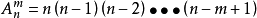
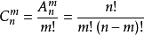

# 最大子数组问题

## 排列组合定义及公式

### 排列
从n个不同元素中，任取m（m<=n，m与n均为自然数，下同）个元素按照一定的顺序排成一列，叫做从n个不同元素中取出m个元素的一个排列；从n个不同元素中取出m（m<=n）个元素的所有排列的个数，叫做从n个不同元素中取出m个元素的排列数，用符号A(n,m)表示。

计算公式：

### 组合
从n个不同元素中，任取m(m<=n)个元素并成一组，叫做从n个不同元素中取出m个元素的一个组合；从n个不同元素中取出m(m<=n)个元素的所有组合的个数，叫做从n个不同元素中取出m个元素的组合数。用符号C(n,m)表示。

计算公式：

## 暴力求解方法

